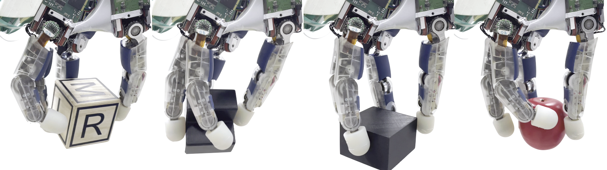

## Estimator-Coupled Reinforcement Learning for Robust Purely Tactile In-Hand Manipulation
[Lennart Röstel](https://scholar.google.com/citations?user=BPUd5h0AAAAJ&hl=en&oi=sra) &ensp; [Johannes Pitz](https://www.linkedin.com/in/johannes-pitz/){:target="_blank"} &ensp; [Leon Sievers](https://www.linkedin.com/in/leon-sievers/){:target="_blank"} &ensp; [Berthold Bäuml](https://scholar.google.com/citations?hl=en&user=fjvpDsEAAAAJ){:target="_blank"}

submitted to the _International Conference on Humanoid Robots 2023_

<iframe width="746" height="420" src="https://www.youtube.com/embed/P8jSDg5TA_E" title="YouTube video player" frameborder="0" allow="accelerometer; autoplay; clipboard-write; encrypted-media; gyroscope; picture-in-picture; web-share" allowfullscreen></iframe>

## Abstract

This paper identifies the culprits of naively combining learning-based controllers and state estimators for robotic in-hand manipulation. Specifically, we tackle the challenging task of purely tactile, goal-conditioned dextrous in-hand reorientation with the hand pointing downwards.
Here, we observe that due to the limited sensing available, many control strategies that are feasible in simulation do not allow for accurate state estimation. Hence, separately training the controller and the estimator, and combining the two at test time, leads to poor performance. 
Our proposed solution to this problem involves training a control policy by reinforcement learning coupled with the state estimator in simulation. 
We show that this approach leads to more robust state estimation and overall higher performance on the task while maintaining an interpretability advantage over fully end-to-end learning approaches. 
Due to our unified learning scheme and an end-to-end gpu-accalerated implementation, learning only takes 5h to 8h on a single GPU.
In simulation experiments with the DLR-Hand II and for four significantly different object shapes, we provide an in-depth analysis of the performance of our approach. 
Finally, we show the successful sim2real transfer with rotating the objects to all 24 possible $$\pi/2$$-orientations.

---

<iframe width="746" height="420" src="https://www.youtube.com/embed/rIDo_DmlDF4" title="YouTube video player" frameborder="0" allow="accelerometer; autoplay; clipboard-write; encrypted-media; gyroscope; picture-in-picture; web-share" allowfullscreen></iframe>

---

## Interactive Analysis
Below are interactive visualization of rollouts of the estimator-coupled policy (EcRL) and the AdaEstim baseline.
To replay the animation please select "Open Controls" in the upper right corner. Then under "Animations" press "play".

### EcRL (robust)
<embed type="text/html" src="../assets/imgs/humanoids23/scene_22_ecrl.html" width="746" height="400">

### AdaEstim (non-robust)
<embed type="text/html" src="../assets/imgs/humanoids23/scene_22_ma.html" width="746" height="400">
For reference, this trajectory corresponds to figure 2 a) in the paper.
