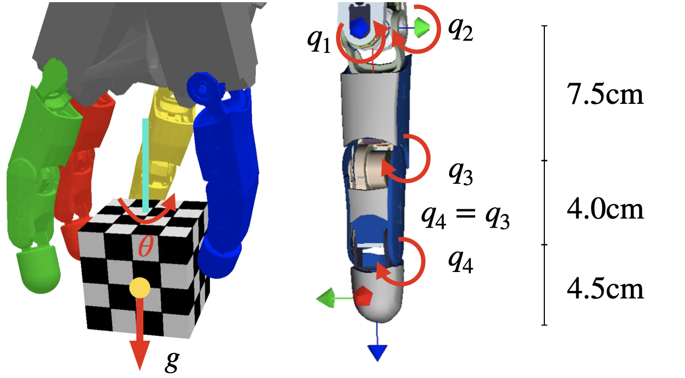

# Learning Purely Tactile In-Hand Manipulation with a Torque-Controlled Hand

This site complements our ICRA 2022 paper [**Learning Purely Tactile In-Hand Manipulation with a Torque-Controlled Hand**](https://arxiv.org/abs/2204.03698){:target="_blank"} by
[Leon Sievers\*](https://www.linkedin.com/in/leon-sievers/){:target="_blank"}, [Johannes Pitz\*](https://www.linkedin.com/in/johannes-pitz/){:target="_blank"} and [Berthold Bäuml](https://scholar.google.com/citations?hl=en&user=fjvpDsEAAAAJ){:target="_blank"}.    

Here we are providing more information on the robotic hardware as well as the parameters used during training.

<iframe width="746" height="420" src="https://www.youtube.com/embed/ilDlO94lm1g" title="YouTube video player" frameborder="0" allow="accelerometer; autoplay; clipboard-write; encrypted-media; gyroscope; picture-in-picture" allowfullscreen></iframe>

[comment]: 

# Abstract

---
We show that a purely tactile dextrous in-hand manipulation task with continuous regrasping, requiring permanent force closure, can be learned from scratch and executed robustly on a torque-controlled humanoid robotic hand. The task is rotating a cube without dropping it, but in contrast to [OpenAI's seminal cube manipulation task](https://openai.com/blog/learning-dexterity/){:target="_blank"}, the palm faces downwards and no cameras but only the hand's position and torque sensing are used. Although the task seems simple, it combines for the first time all the challenges in execution as well as learning that are important for using in-hand manipulation in real-world applications. We efficiently train in a precisely modeled and identified rigid body simulation with off-policy deep reinforcement learning, significantly sped up by a domain adapted curriculum, leading to a moderate 600 CPU hours of training time. The resulting policy is robustly transferred to the real humanoid DLR Hand-II, e.g., reaching more than 46 full 2π rotations of the cube in a single run and allowing for disturbances like different cube sizes, hand orientation, or pulling a finger.

Cite this paper as:

    @inproceedings{Sievers2022,
        author = {Leon Sievers and Johannes Pitz and Berthold B{\"a}uml},
        booktitle = {Proc. IEEE International Conference on Robotics and Automation},
        date-added = {2021-10-03 10:55:06 +0200},
        date-modified = {2022-04-11 09:37:32 +0200},
        title = {Learning Purely Tactile In-Hand Manipulation with a Torque-Controlled Hand},
        year = {2022}}
        
---
# Hand

We use the [DLR Hand II](https://www.dlr.de/rm/en/Portaldata/52/Resources/Roboter_und_Systeme/Hand/icra2001next.pdf){:target="_blank"}.

||$$q_1$$|$$q_2$$|$$q_3$$|
$$\Theta_{\text{min}}$$|$$-30^{\circ}$$|$$-20^{\circ}$$|$$-10^{\circ}$$
$$\Theta_{\text{max}}$$|$$30^{\circ}$$|$$86^{\circ}$$|$$105^{\circ}$$
$$\Theta_{\text{lower}}$$|$$-30^{\circ}$$|$$-10^{\circ}$$|$$-5^{\circ}$$
$$\Theta_{\text{upper}}$$|$$30^{\circ}$$|$$30^{\circ}$$|$$30^{\circ}$$
$$K_\text{P}$$|$$3.69 \frac{\text{Nm}}{\text{rad}}$$|$$3.69 \frac{\text{Nm}}{\text{rad}}$$|$$3.69 \frac{\text{Nm}}{\text{rad}}$$
$$K_\text{D}$$|$$0.25 \frac{\text{Nm s}}{\text{rad}}$$|$$0.25 \frac{\text{Nm s}}{\text{rad}}$$|$$0.25 \frac{\text{Nm s}}{\text{rad}}$$
$$K_\text{e}$$|$$25 \frac{\text{Nm}}{\text{rad}}$$|$$25 \frac{\text{Nm}}{\text{rad}}$$|$$25 \frac{\text{Nm}}{\text{rad}}$$
$$F_\text{static}$$|$$0.02\text{Nm}$$|$$0.02\text{Nm}$$|$$0.02\text{Nm}$$

Hand dimensions as well as the angles and their limits. $$\Theta_{\text{min}}$$ and $$\Theta_{\text{max}}$$ denote the physical limits of the real kinematics while $$\Theta_{\text{lower}}$$ and $$\Theta_{\text{upper}}$$ are used for the simulated hand as well as the scaling of the network output. The PD Impedance Controller is parameterized by $$K_{\text{P}}$$ and $$K_{\text{D}}$$. The parasitic stiffness is modeled by $$K_{\text{e}}$$. $$F_{\text{static}}$$ denotes the static friction force.

---
# Simulator

We are using [PyBullet](https://pybullet.org/){:target="_blank"} as our rigid body simulator.

### Simulator Configuration
#### Initial Learning

|earth_acceleration|9.81 $$\frac{\text{m}}{\text{s}^2}$$
|simulation_frequency|500 $$\text{Hz}$$
|network_frequency|10 $$\text{Hz}$$
|steps_before_gravity_onset|4
|friction_lateral_tip|0.9
|friction_lateral_others|0.09
|friction_lateral_tip_random|0.0
|friction_spinning|0.1
|cube_mass|0.05 $$\text{kg}$$
|cube_length|0.08 $$\text{m}$$
|cube_mass_random|0.005 $$\text{kg}$$
|cube_position_random|\[0.001, 0.001, 0.005\] $$\text{m}$$
|cube_rotation_random|\[0.01, 0.01, 0.1\] $$\text{rad}$$
|motor_noise_std|0.002 $$\text{rad}$$
|sticky_action_probability|0.1

#### Continue Learning

|friction_lateral_tip_random|0.1
|friction_spinning|0.1
|motor_noise_std|0.02 $$\text{rad}$$

---
# Learning

We use the [Soft Actor-Critic](https://arxiv.org/abs/1812.05905v2){:target="_blank"} Alogirthm.

### Reward Constants

|$$\lambda_{\text{spin}}$$|16
|$$\lambda_{\text{Z}}$$|100
|$$\lambda_{\text{plane}}$$|300
|$$\lambda_{\text{rot}}$$|50
|$$\lambda_{\text{proxy}}$$|25

### Learning Configuration
#### Initial Learning

|num_worker|12
|local_steps_per_update|25
|gradient_steps_per_update|100
|batch_size|256
|initial_no_update|2000
|initial_random_steps|10000
|curriculum_start|2e6
|curriculum_length|4e6
|num_layers|2
|hidden_size|512
|replay_size|1.5e5
|entropy_target|-6
|alpha_initial|0.2
|gamma|0.9
|lambda_weight_decay|2.5e-4
|max_episode_length|100
|num_observation_stack|5
|max_reward_rotation|1 $$\frac{\text{rad}}{\text{s}}$$

#### Continue Learning

|replay_size|1.5e6
|entropy_target|-8
|gamma|0.92
|lambda_weight_decay|2.5e-4
|max_episode_length|200
|num_observation_stack|5
|max_reward_rotation|0.7 $$\frac{\text{rad}}{\text{s}}$$
