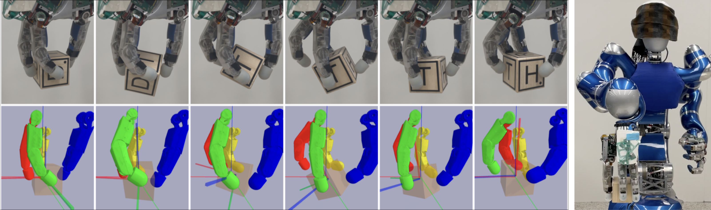

# Dextrous Tactile In-Hand Manipulation Using a Modular Reinforcement Learning Architecture

This site complements our paper [**Dextrous Tactile In-Hand Manipulation Using a Modular Reinforcement Learning Architecture**](https://arxiv.org/abs/2303.04705){:target="_blank"} by
[Johannes Pitz](https://www.linkedin.com/in/johannes-pitz/){:target="_blank"}, [Lennart Röstel](https://scholar.google.com/citations?user=BPUd5h0AAAAJ&hl=en&oi=sra), [Leon Sievers](https://www.linkedin.com/in/leon-sievers/){:target="_blank"} and [Berthold Bäuml](https://scholar.google.com/citations?hl=en&user=fjvpDsEAAAAJ){:target="_blank"}.

<iframe width="746" height="420" src="https://www.youtube.com/embed/0VvSIvtHTq0" title="YouTube video player" frameborder="0" allow="accelerometer; autoplay; clipboard-write; encrypted-media; gyroscope; picture-in-picture; web-share" allowfullscreen></iframe>

# Abstract

Dextrous in-hand manipulation with a multi-fingered robotic hand is a challenging task, esp. when performed with the hand oriented upside down, demanding permanent force-closure, and when no external sensors are used.
For the task of reorienting an object to a given goal orientation (vs. infinitely spinning it around an axis), the lack of external sensors is an additional fundamental challenge as the state of the object has to be estimated all the time, e.g., to detect when the goal is reached. In this paper, we show that the task of reorienting a cube to any of the 24 possible goal orientations in a π/2-raster using the torque-controlled DLR-Hand II is possible. The task is learned in simulation using a modular deep reinforcement learning architecture: the actual policy has only a small observation time window of 0.5s but gets the cube state as an explicit input which is estimated via a deep differentiable particle filter trained on data generated by running the policy. In simulation, we reach a success rate of 92% while applying significant domain randomization. Via zero-shot Sim2Real-transfer on the real robotic system, all 24 goal orientations can be reached with a high success rate.

Cite this paper as:

    @inproceedings{Pitz2023,
        author = {Johannes Pitz and Lennart R{\"o}stel and Leon Sievers and Berthold B{\"a}uml},
        booktitle = {Proc. IEEE International Conference on Robotics and Automation},
        title = {Dextrous Tactile In-Hand Manipulation Using a Modular Reinforcement Learning Architecture},
        year = {2023}}
        
---
## Learning and Simulation Configuration

For the overall setup, please refer to our [previous work](icra22.md). 
Here we only highlight important parameters and list those that differ from the original implementation.

### Hand

||$$q_1$$|$$q_2$$|$$q_3$$|
$$\Theta_{\text{lower}}$$|$$-30^{\circ}$$|$$-20^{\circ}$$|$$-10^{\circ}$$
$$\Theta_{\text{upper}}$$|$$30^{\circ}$$|$$86^{\circ}$$|$$105^{\circ}$$
$$K_\text{P}$$|$$5 \frac{\text{Nm}}{\text{rad}}$$|$$5 \frac{\text{Nm}}{\text{rad}}$$|$$5 \frac{\text{Nm}}{\text{rad}}$$
$$K_\text{D}$$|$$0.36 \frac{\text{Nm s}}{\text{rad}}$$|$$0.36 \frac{\text{Nm s}}{\text{rad}}$$|$$0.36 \frac{\text{Nm s}}{\text{rad}}$$

### Simulation

|$$\tau_{\text{max}}$$|1.0 $$\text{Nm}$$
|$$K_P$$|5.0 $$\frac{\text{Nm}}{\text{rad}}$$
|cube_mass_random|0.02 $$\text{kg}$$
|cube_length_random|0.005 $$\text{m}$$
|friction_spinning ($$\eta_\mathrm{spin}$$)| $$\mathtt{loguniform}$$(2e-4, 2e-2)

### Reward Coefficients

|$$\lambda_{\text{pos}}$$|5.0e6
|$$\lambda_{\text{clip}}$$|10.0
|$$\lambda_{\text{drop}}$$|-5.0
|$$\lambda_{\text{succ}}$$|500.0
|$$\lambda_{\theta}$$|10.0
|$$\epsilon_{\theta}$$|0.3
|$$\lambda_{\text{pos}}'$$|1.0e4
|$$\lambda_{\theta}'$$|640
|$$\lambda_{\text{clip}}'$$|38.4
|$$\lambda_{\text{pos}}''$$|1.0e5
|$$\lambda_{\phi}$$|200.0
|$$\lambda_{\text{clip}}''$$|20.0

### Training

|replay buffer size|1.5e6
|# workers|120
|hidden layers|2
|hidden units|512

#### S1

|$$\gamma$$|0.95
|T_s|0.06 $$\text{s}$$|

Curriculum: Starts with $$0.1g$$ and ends with $$1.0g$$

#### S2

|$$\gamma$$|0.97
|T_s|0.2665 $$\text{s}$$|

#### S5

|$$\gamma$$|0.98
|T_s|0.2665 $$\text{s}$$|
|random_force_mag|0.04 $$\text{N}$$
|random_force_std|0.008 $$\text{N}$$
|random_torque_mag|0.002 $$\text{Nm}$$
|random_torque_std|0.0004 $$\text{Nm}$$

Random forces act on the cube. Magnitue (Normal distribution as above) and direction (uniform) are sampled every 0.5 $$\text{s}$$.

---
## Estimator
For state estimation, we employ the [Deep Differentiable Proposal Particle Filter](https://www.youtube.com/watch?v=SaBwlCRnR3k){:target="_blank"} method with the following hyperparameters

|# particles (inference)|50
|# particles (training)|20
|hidden units (proposal & update models)|512
|hidden layers (proposal & update models)|2
|learning rate|1e-3
|training sequence length|100
|weight decay|1e-6
|dropout rate|0.1
|batchsize|320
|gradient clipping by value|5.0

---
## Training Details

The first phase of the training (S1) takes around a week to train.
The second phase (S2), with the simple reward function, takes around 2 days.
S3: Collecting the data (in parallel on 24 cores), and training the estimator (on a Tesla T4 GPU) takes less than a day.
The iterative refinement of the estimator (S4) takes about 1.5 hours per iteration.
Finally, refining the policy on the estimator output (S5) takes only a few hours.
(Note the training has not fully converged at that point, but the results on the real system did not improve with more training time.)
