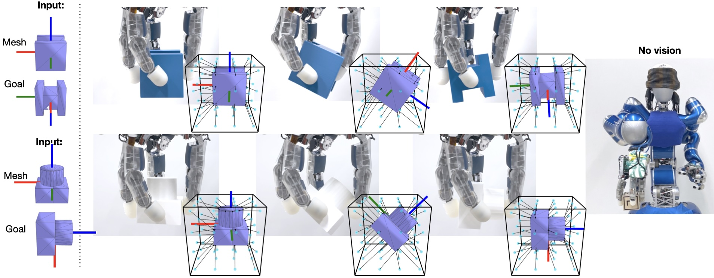

# Learning a Shape-Conditioned Agent for Purely Tactile In-Hand Manipulation of Various Objects

This site complements our paper [**Learning a Shape-Conditioned Agent for Purely Tactile In-Hand Manipulation of Various Objects**](){:target="_blank"} by
[Johannes Pitz\*](https://www.linkedin.com/in/johannes-pitz/){:target="_blank"}, [Lennart Röstel\*](https://scholar.google.com/citations?user=BPUd5h0AAAAJ&hl=en&oi=sra), [Leon Sievers](https://www.linkedin.com/in/leon-sievers/){:target="_blank"} and [Berthold Bäuml](https://scholar.google.com/citations?hl=en&user=fjvpDsEAAAAJ){:target="_blank"}.

<iframe width="746" height="420" src="https://www.youtube.com/watch?v=5I9RQT82m-A" title="YouTube video player" frameborder="0" allow="accelerometer; autoplay; clipboard-write; encrypted-media; gyroscope; picture-in-picture; web-share" allowfullscreen></iframe>

# Abstract

Reorienting diverse objects with multi-fingered hands is a challenging task in robotic in-hand manipulation.
Unlike the human counterpart, current methods for goal-oriented in-hand reorientation are either object-specific or require permanent supervision of the object state from visual sensors. 
In this work, we address this gap by training shape-conditioned agents to reorient diverse objects in hand, relying purely on torque and position feedback (i.e., purely tactile). 
To achieve this, we propose a learning framework that exploits shape information in a reinforcement learning policy and a learned state estimator. 
We find that representing 3D shapes by vectors from a fixed set of basis points to the shape's surface, transformed by its predicted 3D pose, is especially helpful for learning dexterous in-hand manipulation agents. 
Our simulation and real-world experiments show the reorientation of many objects with high success rates, on par with state-of-the-art results obtained with specialized single-object agents.
Moreover, we show generalization to novel objects, achieving success rates of ∼90% even for some non-convex shapes.

<!-- Cite this paper as:

    @inproceedings{Pitz2024,
        author = {Johannes Pitz and Lennart R{\"o}stel and Leon Sievers and Berthold B{\"a}uml},
        booktitle = {Proc. IEEE/RSJ International Conference on Intelligent Robots and Systems},
        title = Learning a Shape-Conditioned Agent for Purely Tactile In-Hand Manipulation of Various Objects},
        year = {2024}}
        
--- -->
