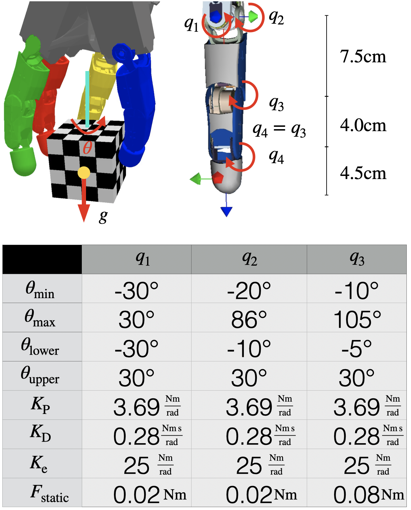
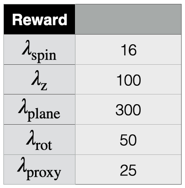
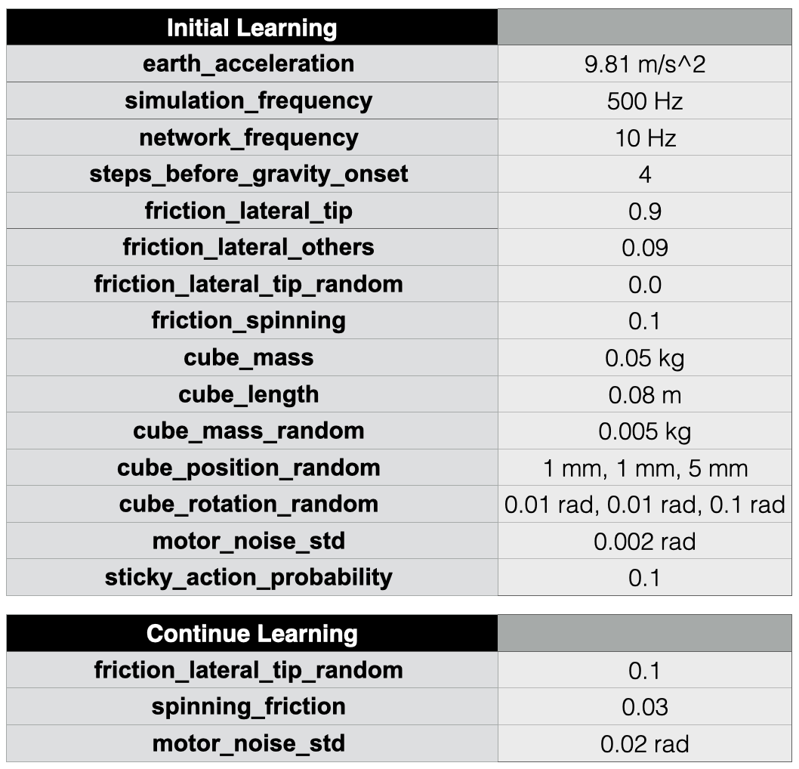
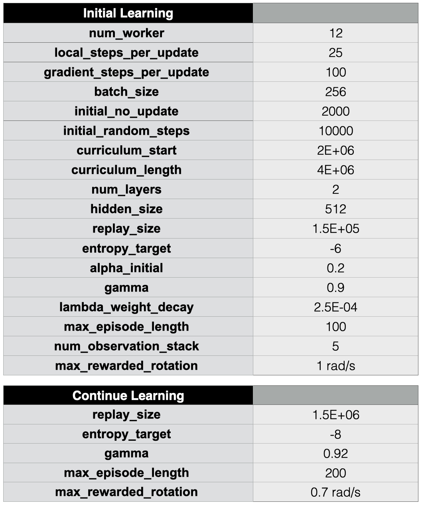

# Learning Purely Tactile In-Hand Manipulation with a Torque-Controlled Hand
### Leon Sievers\*, Johannes Pitz\*, Berthold Bäuml

```
@article{Sievers2022,
  title={Learning Purely Tactile In-Hand Manipulation with a Torque-Controlled Hand},
  author={Sievers, Leon and Pitz, Johannes and Bäuml, Berthold},
  booktitle={ICRA 2022},
  year={2021}
}
```

## Paper

[](resources/2022-icra-manipulation.pdf)

## Video



## Hand Configuration


Hand dimensions as well as the angles and their limits. θmin and θmax denote the physical limits of the real kinematics while θlower and θupper are used for the simulated hand as well as the scaling of the network output. The PD Impedance Controller is parameterized by KP and KD. The parasitic stiffness is modeled by Ke. Fstatic denotes the static friction force. 

## Reward Constants




## Simulator Configuration


"Initial Learning" refers to the learning from scratch, which includes the curriculm. "Continue Learning" refers to the fine tuning that we run with trained polices before deploying them on the real system. 

## Learning Configuration


